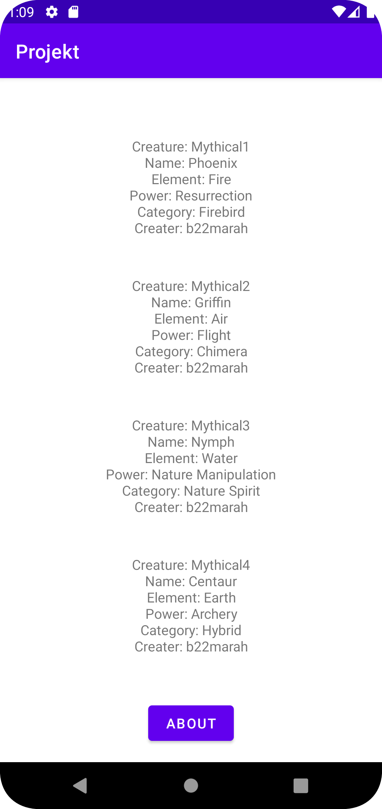
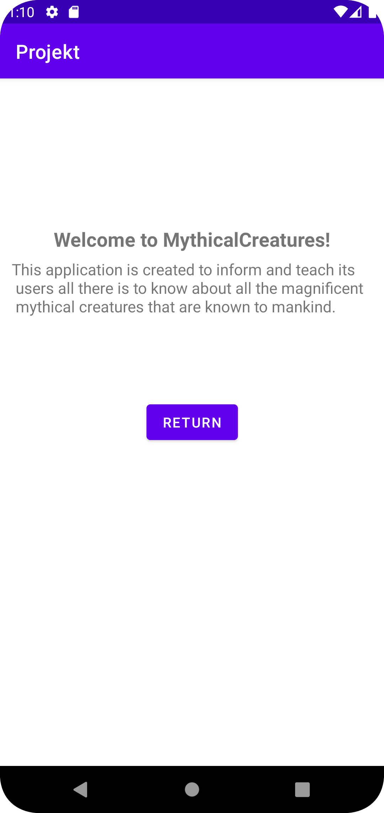

# Projekt-Assignment

### 1: Creating recyclerView:
The first thing i did for the project was to create / change my "activity_main" to fit my intentions for the project, which is to build a application that presents data of mythical creatures
to inform / teach it's users about this subject. For this i needed a recyclerView, which is where all by Items will be listed and displayed as a list on the same page. With this i also created
a button, the button is supposed to be a toggle between the about-page and the landing-page / recyclerView, where all the Json-data is presented.

#### Code-snippet of recyclerView(1):
```
<?xml version="1.0" encoding="utf-8"?>
<androidx.constraintlayout.widget.ConstraintLayout xmlns:android="http://schemas.android.com/apk/res/android"
    xmlns:app="http://schemas.android.com/apk/res-auto"
    xmlns:tools="http://schemas.android.com/tools"
    android:layout_width="match_parent"
    android:layout_height="match_parent"
    tools:context=".MainActivity">

    <androidx.recyclerview.widget.RecyclerView
        android:id="@+id/recyclerview"
        ...
    />

    <Button
        android:id="@+id/button"
        ...
        android:onClick="goToAboutPage"
    />
        
</androidx.constraintlayout.widget.ConstraintLayout>
```

### 2: Creating Items for the recyclerView:
After creating my recyclerView, i started a new activity, "activity_second" which is where the Items for the recyclerView is created. Inside this XML-file, i've included a TextView, which is
where all the data actually will be presented. After all the Items are stored in each separate TextView, it's then displayed as an item inside our recyclerView, which we earlier talked about.

#### Code-snippet TextView (2):
```
<?xml version="1.0" encoding="utf-8"?>
<LinearLayout xmlns:app="http://schemas.android.com/apk/res-auto"
    xmlns:tools="http://schemas.android.com/tools"
    xmlns:android="http://schemas.android.com/apk/res/android"
    android:layout_width="match_parent"
    android:layout_height="wrap_content"
    android:orientation="horizontal"
    tools:context=".MainActivity">

    <TextView
        android:id="@+id/name"
        android:layout_width="match_parent"
        android:layout_height="wrap_content"
        android:gravity="center|center_horizontal|center_vertical"
        android:padding="20dp"
        app:layout_constraintStart_toStartOf="parent"
        app:layout_constraintTop_toTopOf="parent" />

</LinearLayout>
```

### 3: Creating About-page:
And lastly, for the last and final activity, "activity_about.xml" we have created two TextViews, as well as a button. The button is once again meant to be a toggle between the About-page and the
recycler-page. And for the two TextViews we have a header-view as well as the informative text for the application. The text here is hardcoded, so there are no external / internal links here, only
the written text that's already provided inside the TextViews themselves.

#### Code-snippet About-page(3):
```
<?xml version="1.0" encoding="utf-8"?>
<androidx.constraintlayout.widget.ConstraintLayout xmlns:android="http://schemas.android.com/apk/res/android"
    ...
    tools:context=".AboutActivity">

    <TextView
        android:id="@+id/aboutText"
        ...
        android:gravity="center_horizontal|top"
        android:paddingTop="150dp"
        android:text="Welcome to MythicalCreatures!"
        android:textSize="20sp"
        android:textStyle="bold"
        ...
    />

    <TextView
        ...
        android:text="This application is created to inform and teach \n its users all there is to know about all the magnificent \n mythical creatures that are known to mankind. The way we're trying to achieve our goals of educating \n our users is by defining all known creatures, \n as well as providing insightful information about how \n these creatures are Categorized, what makes them unique, as well as their elements and powers."
        ...
        app:layout_constraintTop_toTopOf="@+id/aboutText" 
    />

    <Button
        android:id="@+id/AboutButton"
        ...
        android:onClick="closeAboutPage"
        android:text="Return"
        ...
        app:layout_constraintTop_toTopOf="@+id/aboutText" 
    />
    
</androidx.constraintlayout.widget.ConstraintLayout>
```


# Pictures and Videos of the Application:
## Start screen / landing page Screenshot:


## About page Screenshot:


## Application demonstration video:
