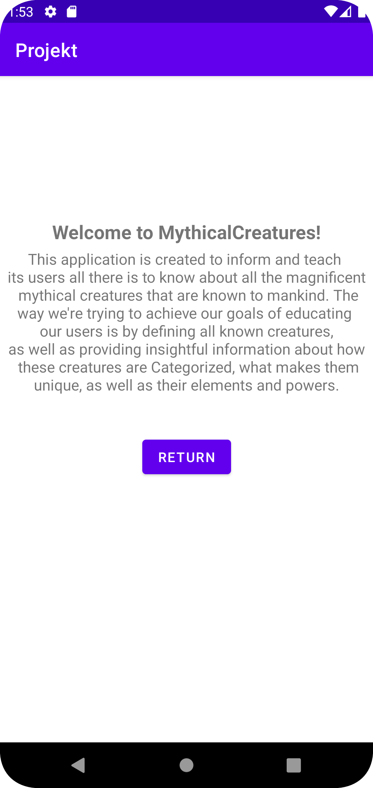

# Projekt-Assignment

### 1: Creating recyclerView:
The first thing i did for the project was to create / change my "activity_main" to fit my intentions for the project, which is to build a application that presents data of mythical creatures
to inform / teach it's users about this subject. For this i needed a recyclerView, which is where all by Items will be listed and displayed as a list on the same page. With this i also created
a button, the button is supposed to be a toggle between the about-page and the landing-page / recyclerView, where all the Json-data is presented.

#### Code-snippet: recyclerView (1):
```
<?xml version="1.0" encoding="utf-8"?>
<androidx.constraintlayout.widget.ConstraintLayout xmlns:android="http://schemas.android.com/apk/res/android"
    xmlns:app="http://schemas.android.com/apk/res-auto"
    xmlns:tools="http://schemas.android.com/tools"
    android:layout_width="match_parent"
    android:layout_height="match_parent"
    tools:context=".MainActivity">

    <androidx.recyclerview.widget.RecyclerView
        android:id="@+id/recyclerview"
        ...
    />

    <Button
        android:id="@+id/button"
        ...
        android:onClick="goToAboutPage"
    />
        
</androidx.constraintlayout.widget.ConstraintLayout>
```

### 2: Creating Items for the recyclerView:
After creating my recyclerView, i started a new activity, "activity_second" which is where the Items for the recyclerView is created. Inside this XML-file, i've included a TextView, which is
where all the data actually will be presented. After all the Items are stored in each separate TextView, it's then displayed as an item inside our recyclerView, which we earlier talked about.

#### Code-snippet: TextView (2):
```
<?xml version="1.0" encoding="utf-8"?>
<LinearLayout xmlns:app="http://schemas.android.com/apk/res-auto"
    xmlns:tools="http://schemas.android.com/tools"
    xmlns:android="http://schemas.android.com/apk/res/android"
    android:layout_width="match_parent"
    android:layout_height="wrap_content"
    android:orientation="horizontal"
    tools:context=".MainActivity">

    <TextView
        android:id="@+id/name"
        android:layout_width="match_parent"
        android:layout_height="wrap_content"
        android:gravity="center|center_horizontal|center_vertical"
        android:padding="20dp"
        app:layout_constraintStart_toStartOf="parent"
        app:layout_constraintTop_toTopOf="parent" />

</LinearLayout>
```

### 3: Creating About-page:
And lastly, for the last and final activity, "activity_about.xml" we have created two TextViews, as well as a button. The button is once again meant to be a toggle between the About-page and the
recycler-page. And for the two TextViews we have a header-view as well as the informative text for the application. The text here is hardcoded, so there are no external / internal links here, only
the written text that's already provided inside the TextViews themselves.

#### Code-snippet: About-page (3):
```
<?xml version="1.0" encoding="utf-8"?>
<androidx.constraintlayout.widget.ConstraintLayout xmlns:android="http://schemas.android.com/apk/res/android"
    ...
    tools:context=".AboutActivity">

    <TextView
        android:id="@+id/aboutText"
        ...
        android:gravity="center_horizontal|top"
        android:paddingTop="150dp"
        android:text="Welcome to MythicalCreatures!"
        android:textSize="20sp"
        android:textStyle="bold"
        ...
    />

    <TextView
        ...
        android:text="This application is created to inform and teach \n its users all there is to know about all the magnificent \n mythical creatures that are known to mankind. The way we're trying to achieve our goals of educating \n our users is by defining all known creatures, \n as well as providing insightful information about how \n these creatures are Categorized, what makes them unique, as well as their elements and powers."
        ...
        app:layout_constraintTop_toTopOf="@+id/aboutText" 
    />

    <Button
        android:id="@+id/AboutButton"
        ...
        android:onClick="closeAboutPage"
        android:text="Return"
        ...
        app:layout_constraintTop_toTopOf="@+id/aboutText" 
    />
    
</androidx.constraintlayout.widget.ConstraintLayout>
```

### 4: Defining the MythicalCreatures object:

First of all a new class was created called "MythicalCreatures", this class is what actually is called on to present the mythical creatures in the specific format
that's shown in the Code-snippet below. This class has a constructor which takes in parameters for all the properties and inside the class we are assigning the corresponding
data to different variables. By doing this, we can create instances of the class with specific data for each corresponding variable.
Then we have a method called "toString", which will be the method called upon to retrieve and present the data on a recyclerView later. In this method 
we are creating a string called "presentCreatures", which creates the structure of the presentation of each creature Item, this string is using all the variables earlier created
that has it's corresponding unique "ID" from the API we are fetching and retrieving our data from. So when the method "toString" is called, it will return the formatted string
of all the properties for all the individual creatures.

#### Code-snippet: MythicalCreatures class (4):
```
package com.example.projekt;

public class MythicalCreatures {
    private String ID;
    private String name;
    ...

    public MythicalCreatures(String ID, String name, String type, String company, String location, String category) {
        this.ID = ID;
        this.name = name;
        ...
    }

    @Override
    public String toString() {
        String presentCreatures = "Creature: " + ID + "\nName: " + name + "\nElement: " + company + "\nPower: " + location + "\nCategory: " + category + "\nCreater: " + type;
        return presentCreatures;
    }
}
```

### 5: Creating MyViewHolder:

To create the class "MyViewHolder", i first started with making a new class, that extends the RecyclerView.ViewHolder.
Inside this class we have a textView variable with the name "name". This variable is later used in a method called "MyViewHolder", here it's used to find the TextView with the ID "name".
This TextView is what's earlier described as a Item inside our recyclerView, so what this class does is that it recycling and reusing Items / views as item
for every "new item" inside our recyclerView.

#### Code-snippet: MyViewHolder (5):
```
public class MyViewHolder extends RecyclerView.ViewHolder {
    public TextView name;

    public MyViewHolder(@NonNull View itemView) {
        super(itemView);
        name = itemView.findViewById(R.id.name);
    }
}

```

### 6: Creating MyAdapter:

What this class does is that it works like a bridge / adapter between the data im retrieving (list of MythicalCreatures) and the RecyclerView. It is basically a class that takes in parameters to connect 
the data to where it's supposed to be represented, in this case, the data from the API which is found inside my list of MythicalCreatures, and then displays this inside my RecyclerView as individual items.

6.1: When the class first "starts" it takes a parameter "RecyclerView.Adapter<MyViewHolder>", this will be the data that we want to display inside our RecyclerView.

6.2: Inside the "onCreateViewHolder()"-method, the code inflates the layout of "activity_second" and return a MyViewHolder object, which in our case can be described as
a method that's inflating the TextView from activity_second with a instance of MyViewHolder, which is what we are using to display every Item from our API separately.

6.3: Inside the "onBindViewHolder" method, we are binding the data for each Item inside the RecyclerView. Which also means that the data that's inflated in the latest step (6.2),
now is getting overridden to display the corresponding data inside the TextView, which is later placed inside the RecyclerView as an item, following the formatted string we created earlier
with the "toString" method.

6.4: Lastly we have the method "getItemCount()" which is used to return how many Items that exists inside the list of creatures, so with that said, this method is whats used to determine the size of our RecyclerView.

Overall, all these methods focuses on different parts of the code, to handle the retrieved data to then apply and present the retentive data for the users. The method which has been explained
focuses on different key-points to make this hole process possible, and together does what the classname suggest, which is working as a adapter / bridge between the retrieving of the data, and the presenting of the data.

#### Code-snippet: MyAdapter (6):
```
public class MyAdapter extends RecyclerView.Adapter<MyViewHolder> {
    private List<MythicalCreatures> listOfCreatures;
    public MyAdapter(List<MythicalCreatures> listOfCreatures) {
        this.listOfCreatures = listOfCreatures;
    }

    @NonNull
    @Override
    public MyViewHolder onCreateViewHolder(@NonNull ViewGroup parent, int viewType) {
        View view = LayoutInflater.from(parent.getContext()).inflate(R.layout.activity_second, parent, false);
        return new MyViewHolder(view);
    }

    @Override
    public void onBindViewHolder(@NonNull MyViewHolder holder, int position) {
        holder.name.setText(listOfCreatures.get(position).toString());
    }

    @Override
    public int getItemCount() {
        return listOfCreatures.size();
    }
}
```

### 7: Creating my Intent:

7.1: For my intent i created a method inside "MainActivity" that's called "goToAboutPage(View View)". A Intent is used to navigate between different sections / components of the Android application, in this case, for activities.
So for the functionality inside the method. We first start of by creating an Intent object with the name "intent", then we use the "new Intent" constructor with two parameters "this", and "AboutActivity.class".
What this does is that it defines that this context ("this") is used to navigate to the second parameter, which in our case is "AboutActivity.class". The second parameter is the class that's responsible / representing
the data we want to navigate to, using our Intent.
When all this is done, our method calls on the method "startActivity(intent)". By reading the method name we can see that this method is used to start a activity when it's called, and as a parameter we have sent
our newly created Intent, which we know wants to navigate to our "AboutActivity"-class, which in this case will open our "activity_about.xml" where we have our data for the "About-page".

7.2: This activity "activity_about.xml" is later closed (when done reading) with a use of a method called "closeAboutPage(View View)" which can be found inside "AboutActivity".
This method is a super easy method that calls on a predefined method inside Android studios called "finish()", which does what the name suggests, it finishes the active activity, which in our case 
will return us to the "activity_main.xml" / landing-page.

#### Code-snippet: Creating the Intent (7.1):
```
public void goToAboutPage(View view) {
    Intent intent = new Intent(this, AboutActivity.class);
    startActivity(intent);
}
```

#### Code-snippet: Closing the "Intent" / About-page (7.2):
```
public void closeAboutPage(View view) {
    finish();
}
```


### 8: Fetching and presenting the API-data:

8.1: From "MainActivity" is where we fetch our data through an API as well as defining sections of the data, 
where we can later further use and manipulate the given data in different classes, such as we recently described in earlier points ( < 8).

The first thing we do in "MainActivity" after starting the class, is that we fetch the data we are going to use, using our custom API created and provided by the teachers of this course.
Along this we also create a final String called JSON_FILE, where we fetch data from a assets folder i've created for the project, this assets folder holds a copy of the data that is inside the API
we are using. This assets folder is never used in the program though, instead i've used it to see what data i have avaible to work with, and if my API for some reason wouldn't work, i could use the 
JSON_File instead to get the same results.
Here we also declared variables with the corresponding types likes a RecyclerView named "recyclerview", Myadapter named "adapter" and so on...

#### Code-snippet: Declarations and retrieving data from API (8.1):
```
    private final String JSON_URL = "https://mobprog.webug.se/json-api?login=b22marah";
    private final String JSON_FILE = "user_details.json";
    private RecyclerView recyclerView;
    private ArrayList<MythicalCreatures> listOfCreatures;
    private MyAdapter adapter;
```

8.2: Then we have the method "onCreate()". The code inside this method is what's going to be executed the first thing when the application is first started.
Inside this method we are setting the layout of "activity_main.xml" using the following line of code: "setContentView(R.Layout.activity_main)".
Afterwards, the method is creating a new instance of JsonTask (a class provided by our teacher, responsible for fetching and to handle the Json data) and executes 
it with the provided URL inside "JSON_URL"

When this is done, the method finds our recyclerview by an ID search "findViewById(R.id.recyclerview)", then it also initialize "listOfCreatures" as a new (empty) arrayList
holding "MythicalCreatures". Then a new instance of "MyAdapter" is created and called "adapter", again with "listOfCreatures". And lastly th method sets a layout manager of our RecyclerView
to a "LinearLayoutManager" and then sets this adapter to our "RecyclerView".

To summarize this method is used upon starting the application, it's used to fetch and handle the provided Json-data from our API. With this it also sets the layout to present 
as well as defining / creating instances of objects we later are going to work with in different classes.

#### Code-snippet: onCreate (MainActivity) (8.2):
```
@Override
protected void onCreate(Bundle savedInstanceState) {
    super.onCreate(savedInstanceState);
    setContentView(R.layout.activity_main);
    new JsonTask(this).execute(JSON_URL);
    RecyclerView view = findViewById(R.id.recyclerview);
    listOfCreatures = new ArrayList<MythicalCreatures>();
    adapter = new MyAdapter(listOfCreatures);
    view.setLayoutManager(new LinearLayoutManager(this));
    view.setAdapter(adapter);
}
```

8.3: The "onPostExecute" method is first used after the "onCreate" method has been executed. What happens inside this method is that a new instance of an external library 
"Gson" is created and stored
in a variable named "Gson" with the type of 'Gson'. After this a new "TypeToken" is defined to tell the method what type of data is being deserialize.

What this first section does, and what i mean with "deserialize", is the process of the Gson library, which is converting our JSON-data to Java-objects, 
which we can use inside our ArrayList, without
this we wouldn't be able to handle the JSON-data in our ArrayList.

Anyhow, after this we are putting our converted Java-objects (before it was JASON-data) inside our "ArrayList<MythicalCreatures>", and afterwards we add 
ALL our data from this process inside "listOfCreatures".

Then we finish the method by calling on a predefined method called ".notifyDataSetChanged()" that's called on our adapter like this "adapter.notifyDataSetChanged();".
What this method does is that it notifies our adapter that the data has changed, and must be updated.

So to summarize this method, it's used to convert our fetched JSON-data to Java-object that we can use and manipulate, since we cannot to it with the original JASON-data.
After this we are putting the newly converted data we fetched inside our ArrayList, and we are adding all available data inside our "ListOfCreatures" object. And we finish the method
by letting our adapter know there has been a change in the data, and it must be updated / fetched once again, to get the "right" data available.

#### Code-snippet: onPostExecute (MainActivity) (8.3):
```
@Override
public void onPostExecute(String json) {
    Log.d("MainActivity", json);

    Gson gson = new Gson();
    Type type = new TypeToken<ArrayList<MythicalCreatures>>() {}.getType();
    ArrayList<MythicalCreatures> data = gson.fromJson(json, type);
    listOfCreatures.addAll(data);

    adapter.notifyDataSetChanged();
}
```

# Pictures and Videos of the Application:
## Start screen / landing page Screenshot:


## About page Screenshot:


## Application demonstration video:
